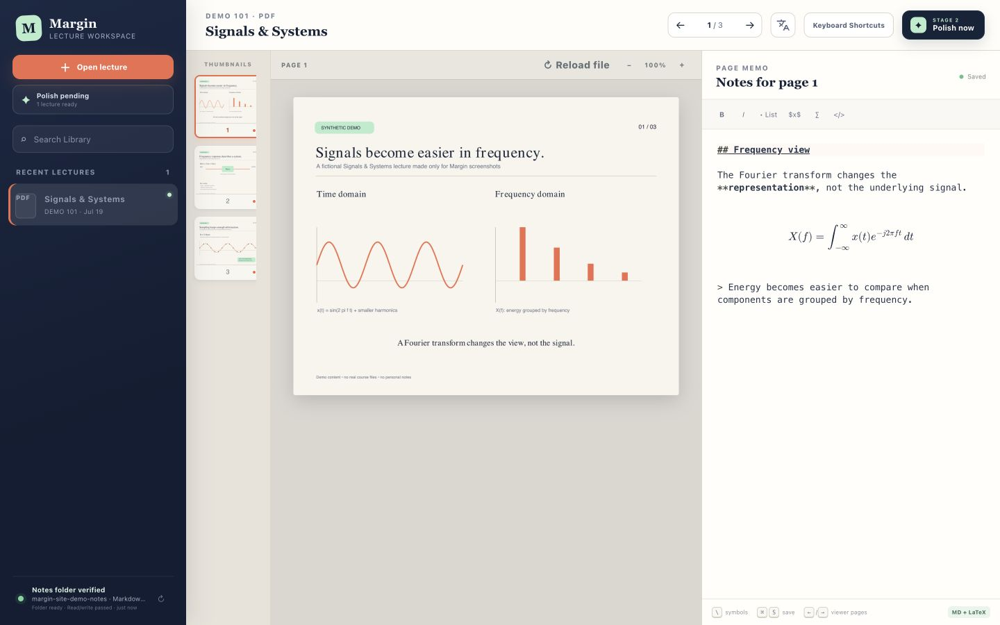
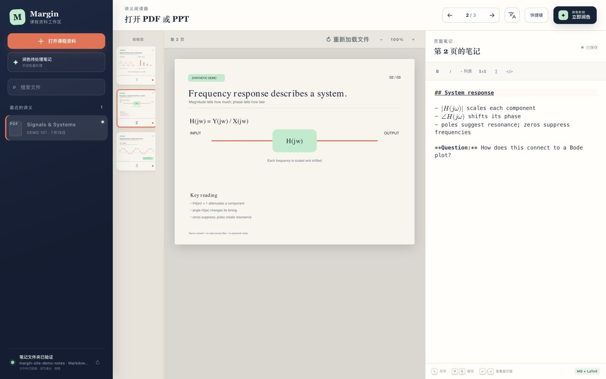

English | [简体中文](README.zh-CN.md)

# Margin

**Lecture notes that stay with the source.**

Margin is a local-first workspace for taking notes directly beside lecture PDFs and PowerPoint slides. Each Markdown/LaTeX memo stays connected to the exact page that inspired it, so your notes keep their context long after class ends.

[Visit the website](https://icycrucifix.github.io/margin/) · [Install Margin](#quick-start) · [Read the documentation](#documentation)



## Why Margin?

Lecture slides and separate note documents quickly drift apart: a formula in your notes makes sense during class, but weeks later it is hard to remember which diagram, definition, or example it referred to. Margin keeps the two sides together.

- **Stay beside the lecture.** Read a PDF or PowerPoint while writing a separate, autosaved memo for each page or slide.
- **Write naturally.** Use Markdown, rendered math, and quick LaTeX suggestions such as `\omega` and `\Omega`.
- **Keep your files.** The original lecture remains untouched, and your sources and notes stay on your own machine.
- **Choose where notes live.** Use any ordinary folder or route everything into an existing Obsidian vault.
- **Finish the job later.** After class, optional Stage 2 polishing can combine the lecture and your rough memos into a structured note.



## From lecture to finished notes

1. **Open the lecture.** Import a `.pdf` or `.pptx`; Margin prepares the pages locally without modifying the source.
2. **Capture what matters.** Write beside each page during class, with every memo automatically preserved in the right context.
3. **Polish when ready.** Keep the raw notes as they are, or use your chosen AI tool to create a structured polished note later.

Obsidian is optional. Plain-folder mode uses portable Markdown links; Obsidian mode adds wiki links, PDF page embeds, and course-folder routing.

## Quick start

On macOS, the guided installer creates a project virtual environment, installs the Python packages, and asks where notes should live:

```bash
./install.command
./start.command
```

After Margin is installed and running, use either the direct local interface at <http://127.0.0.1:4317> or open the hosted interface at <https://icycrucifix.github.io/margin/workspace/>. Both use the same companion and local library.

### Connect the hosted workspace to your local library

The hosted workspace is only the interface. Before it can display a library, each user must install and start the local Margin companion on `127.0.0.1:4317`.

1. Run `./start.command` and leave its terminal window open.
2. Open <https://icycrucifix.github.io/margin/workspace/> in desktop Chrome.
3. Choose **Connect to local Margin**.
4. If Chrome asks, allow this site to connect to apps on this device. Older Chrome versions may describe this as local-network access.
5. In the local **Connect Margin** window, verify that the requester is `https://icycrucifix.github.io`, then choose **Allow connection**.

Chrome receives access only to Margin on this computer through the loopback address. The companion receives read/write access only to the notes folder or Obsidian vault selected during setup and to lecture files the user explicitly imports. GitHub receives no lecture files, notes, vault paths, session token, or filesystem access.

If the browser blocks the confirmation window or the connection still fails, see [Hosted-workspace permissions and troubleshooting](docs/setup.md#connect-the-hosted-workspace).

For manual setup, the folder example creates `~/Documents/Margin Notes` automatically:

```bash
cp config.example.json config.json
python3 -m venv .venv
.venv/bin/python3 -m pip install -r requirements.txt
.venv/bin/python3 -m content_reader.server --open
```

See [docs/setup.md](docs/setup.md) for dependencies, configuration, and auto-start.

See [Codex_Explanation](Codex_Explanation.markdown) for more explanations for the system.

## Stage 1: take page-linked notes

1. Choose **Open lecture** and select a `.pdf` or `.pptx` file.
2. Enter the course code, lecture title, and date.
3. Select a thumbnail, or focus the viewer and use **Left/Right Arrow**, to change pages.
4. Write Markdown in the right-hand editor. `$...$` and `$$...$$` math renders in place.
5. Type `\` followed by a symbol name for LaTeX suggestions such as `\omega` and `\Omega`.

Notes autosave. Each memo lives between stable page markers in a separate Markdown file; the lecture source remains untouched.
Re-uploading a revised file under the same filename carries the earlier page memos into the new copy, and edits remain shared across every same-named upload.
If a page or slide does not render, choose **Reload file** in the viewer toolbar. Margin retries the lecture images without re-importing the source or changing which memo belongs to each page.
Choose **Shortcuts** in the top toolbar, or press `?` outside the memo editor, to display the keyboard shortcut list.

Use the translate icon in the top toolbar to switch the interface between English and Simplified Chinese. The dialog can apply that choice to the interface only, or also set the language for polished notes. If the selected lecture already has a polished note in another language, Margin lets you keep the current note for future runs or mark it for a guarded repolish.

## Stage 2: polish manually or automatically

Margin provides three entry points to the same guarded pipeline:

- **Polish now**: process the selected lecture.
- **Polish pending**: process every missing or stale polished note, one at a time.
- **Optional daily schedule**: enable `auto_polish` in `config.json`; Margin runs the pending queue while its local server is running.

Pressing a Stage 2 action opens simple options. If a signed-in Codex CLI or configured AI command is ready, Margin can run directly. Otherwise, Margin explains that direct polishing is unavailable and offers one-click buttons to copy a hidden one-time polishing prompt or a hidden nightly-automation template into the user's own AI system. Users never need to open the Python source to obtain either prompt.

Codex CLI is used when `polish_command` is `null`. Other local AI agents can still be connected with a JSON command template. AI is optional for Stage 1; advanced users can also write a Stage 2 draft themselves and run the deterministic finalizer.

Stage 2 hashes the source and page memos, rejects stale results, and never rewrites an unchanged polished note. See [docs/polish.md](docs/polish.md).

## Storage layouts

Both modes use the same durable structure:

```text
Lecture Notes/
  _Sources/       untouched PDF/PPTX copies
  Raw/            page-linked class memos
  Polished/       Stage 2 notes
  .content-reader/library.json
  Lecture Notes Hub.md
```

Plain-folder mode uses ordinary relative Markdown links and keeps everything under this central library. Obsidian mode additionally supports wiki links, embedded PDF pages, and routing into existing course-code folders.

The exact file and marker contract is in [docs/storage.md](docs/storage.md). Obsidian-specific behavior is in [docs/obsidian-sync.md](docs/obsidian-sync.md).

## Configuration and safety

`config.json` is gitignored. It controls storage mode/path, local host/port, optional AI command, and optional daily polishing. The server binds to `127.0.0.1` by default. Direct local mutations require Margin's private header. The published workspace must be explicitly paired and every data request requires a short-lived, origin-scoped session held only in browser memory.

Stage 1 works without an AI. For Stage 2, custom agent commands should be wrapped with the narrowest filesystem permissions that agent supports. Margin's finalizer still independently validates the draft path and input hash.

## Documentation

- [docs/setup.md](docs/setup.md) — install, select storage, configure, auto-start, tests
- [docs/storage.md](docs/storage.md) — portable folder and shared file-format contract
- [docs/obsidian-sync.md](docs/obsidian-sync.md) — Obsidian-only wiki links and course routing
- [docs/polish.md](docs/polish.md) — manual queue, built-in daily schedule, own-AI command, no-AI path
